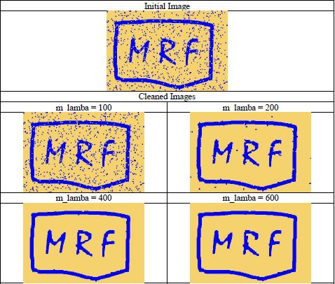
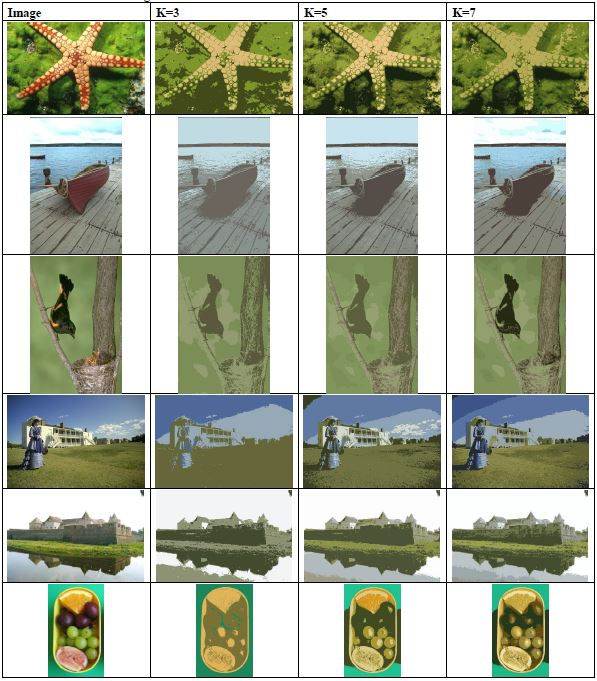

# EE4212-Computer Vision graphcut-mrf
Matlab implementation of binary graphcut for denoising and markov random field for image segmentation

Part of NUS EE4212 - Computer Vision Assignment

Code for binary GraphCut: https://vision.cs.uwaterloo.ca/files/Bk_matlab.zip
Code for multilabel GraphCut: https://vision.cs.uwaterloo.ca/files/gco-v3.0.zip

- Implemented K-Means algorithm
- Utilized reference code from above links to enable denoising and image segmentation capabilities

### Denoising Example

### Image Segmentation Example

